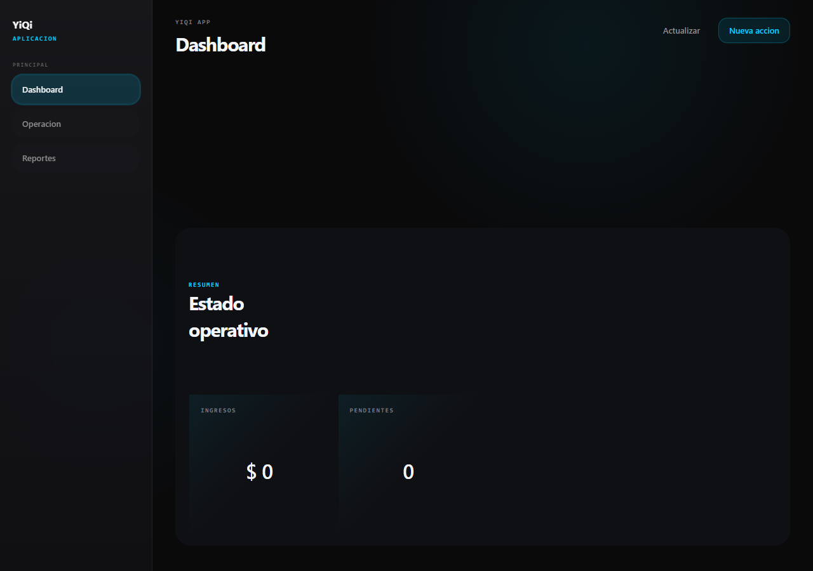

# App shell template

Punto de partida para una app YiQi: topbar de lado a lado, sidebar y area de
contenido, con drawer mobile desde la derecha.



## Archivos

| Archivo | Para que sirve |
|---------|----------------|
| `html/app-shell.html` | Estructura completa, lista para copiar. Solo clases del DS. |

## Regla principal

**Este template no define CSS propio.** Todo sale del canonico:

```html
<link rel="stylesheet" href="https://diguardia.github.io/yiqi-imagen/styles.css">
<script src="https://diguardia.github.io/yiqi-imagen/yiqi-runtime.js"></script>
```

Si algo que necesitas no esta en `styles.css`, **se agrega al Design System, no
a la app**. Un `<style>` local en una app es lo que hace que el sistema diverja.

## Que trae

- **Topbar** (`.topbar.app-topbar`): logo, nombre de app (`.t-pill`), chip de
  cuenta con avatar y selector de esquema, filtro de periodo, actualizar y salir.
- **Sidebar** (`.sidebar`): grupos de navegacion, switch de tema y pie con version.
- **Contenido** (`.content`): grilla de KPIs y panel con tabla.
- **Mobile (<=980px):** la topbar deja solo logo, nombre y hamburguesa; el
  sidebar entra como drawer desde la derecha, a pantalla completa, con boton de
  cerrar (`.nav-close`) alineado con la hamburguesa. Lo maneja `initNavDrawer`
  del runtime — no hace falta JS propio.

## Para adaptarlo

- Cambiar el nombre de la app, las etiquetas de navegacion y los iconos.
- Marcar el item activo con `.is-active` y `aria-current="page"`.
- Reemplazar los KPIs y el panel de ejemplo por el contenido real.
- Mantener los nombres de clase: son el contrato con el DS.
- Los datos del ejemplo son simulados. No dejar datos reales.

## Referencia

Catalogo del DS, **§33 Apps · Shell** y **§34 Apps · Shell celular**.
