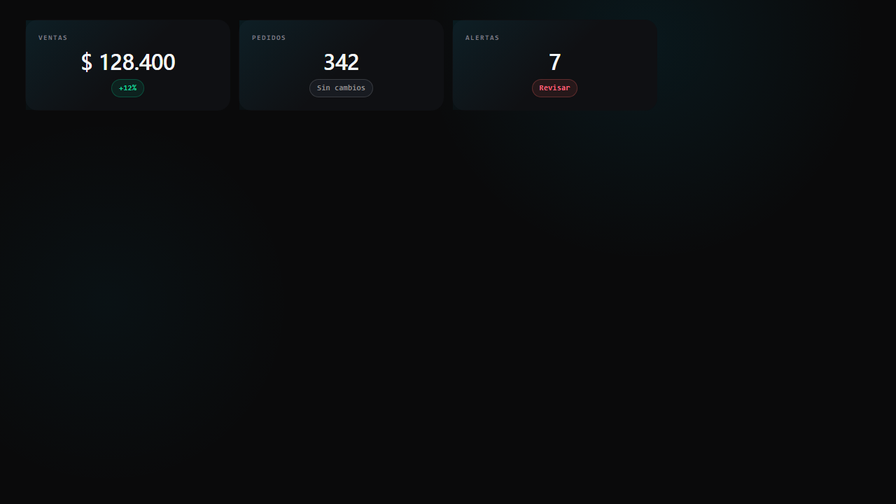

# KPI card legacy template

Este template HTML queda disponible para consumidores legacy.

## React / Next.js

No copiar el HTML. Usar:

```tsx
import { YiQiKpiCard } from '@yiqi/ui/data-display'
```

Pasar label, value, metadata y tono mediante props. Si una variante se repite entre aplicaciones, agregarla al componente canonico.

## HTML / legacy

`html/kpi-card.html` contiene ejemplos con clases del DS. Cargar `styles.css` publicado y no copiar el stylesheet completo.

Los KPIs reales deben mantener fuente validable y los datos simulados deben identificarse como ejemplo o no disponibles.


