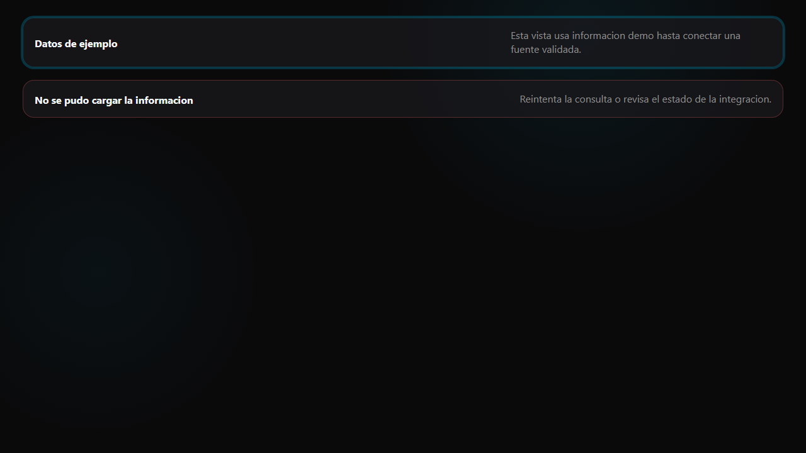

# Runtime banner legacy template

Este template HTML queda disponible para consumidores legacy.

## React / Next.js

No copiar el banner HTML. Usar:

```tsx
import { YiQiRuntimeBanner } from '@yiqi/ui/feedback'
```

Configurar titulo, descripcion, tono y accion mediante props.

## HTML / legacy

`html/runtime-banner.html` puede seguir usandose con `styles.css` publicado para mostrar estados de demo, unavailable o error sin presentar datos simulados como reales.


