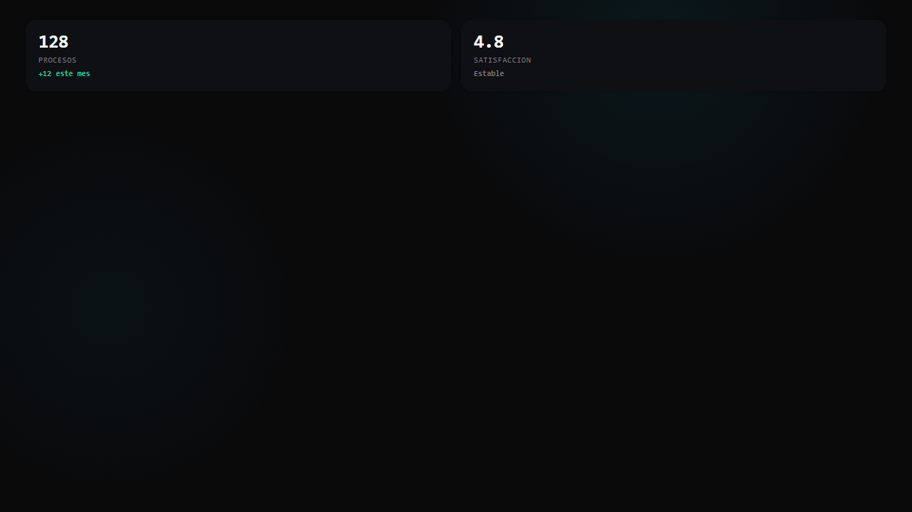

# Trust stats legacy template

Este template HTML queda disponible para consumidores legacy.

## React / Next.js

Para metricas compactas usar:

```tsx
import { YiQiTrustStat } from '@yiqi/ui/data-display'
```

No copiar las variantes HTML para reconstruir el mismo componente en React. La composicion de varias stats se resuelve usando el componente canonico dentro del layout de la aplicacion.

## HTML / legacy

Los archivos `html/trust-inline.html`, `html/trust-cards.html` y `html/trust-grid.html` siguen disponibles para runtimes no React y consumen `styles.css` publicado.


